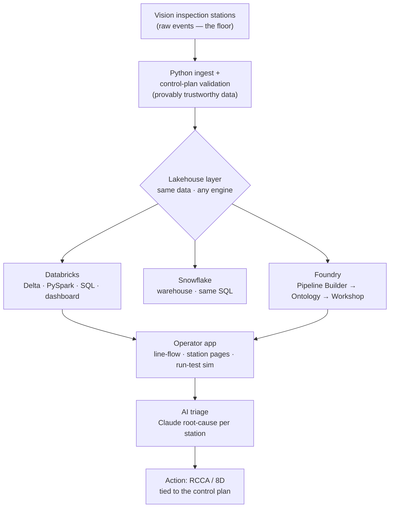

# Architecture — one dataset, across the modern data stack

The senior point of this demo is not four disconnected tools — it's **one flow**,
from a station on the floor to an operator's screen, that runs on whichever engine
the site standardizes on. I model the data; the tool is a swap.

## The same logic, everywhere (that's the proof)

| Layer | Databricks | Snowflake | Foundry | Local reference |
|-------|-----------|-----------|---------|-----------------|
| Pipeline | `src/pipeline_pyspark.py` | `snowflake/*.sql` | Pipeline Builder | `src/pipeline_pandas.py` |
| Rolling FPY (window fn) | ✓ | `snowflake/rolling_fpy.sql` | derived column | `sql/rolling_fpy.sql` |
| p-chart SPC (frozen baseline) | ✓ | `snowflake/spc_p_chart.sql` | derived column | `sql/spc_p_chart.sql` |
| Semantic model | Delta tables | tables | **Ontology** objects | marts CSVs |
| Operator app | Databricks dashboard | — | **Workshop** | `output/dashboard.html` |
| AI triage | notebook + Claude | — | AIP Logic | `src/ai_triage.py` |

## Why this shape

- **Data quality first.** Nothing reaches a metric until it passes the control plan
  (`config/control_plan.yaml`). Garbage in is caught and quarantined, not charted.
- **The ontology == the quality data model.** Mapping raw events to `InspectionStation`
  objects is the same modeling a quality engineer does by hand; Foundry governs it.
- **AI on top, not in the loop.** Claude explains *why* a station drifted and what to
  do — it compresses triage, a human decides. That's the JD's "10x" bullet, safely.
- **Portable by design.** The engine is a business decision (cost, existing contracts);
  the quality logic shouldn't have to be rewritten when it changes. Hence the parity.
